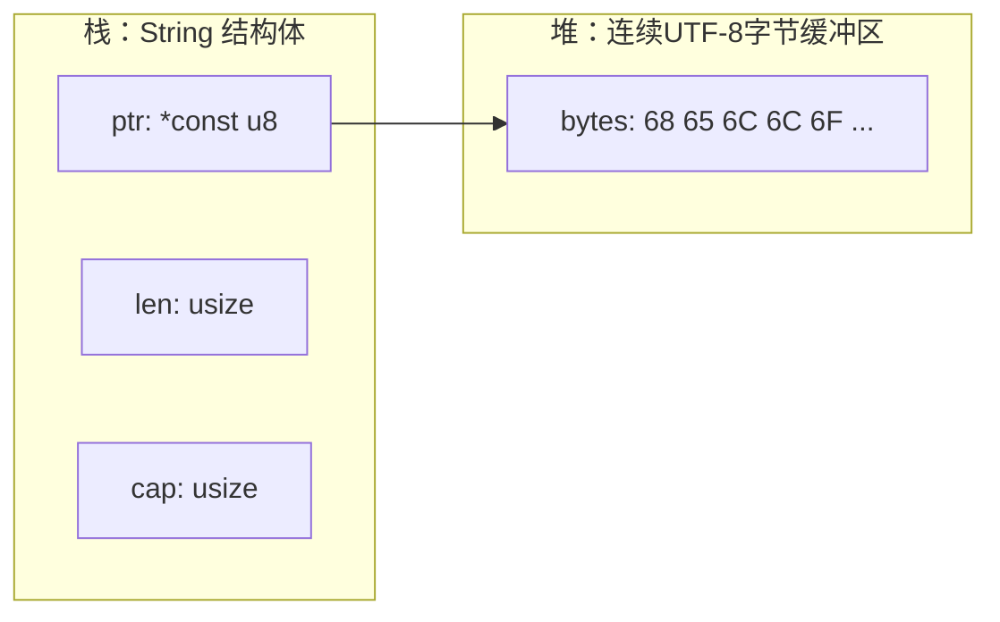

# 第三章 理解所有权

Rust 的所有权系统是 Rust 语言最独特、最核心的特性之一。正是它让 Rust 在没有垃圾回收器的情况下，也能实现**内存安全**和 **高性能**。本章将带你从基础规则，到借用机制、字符串及切片等内容逐步理解 Rust 的所有权。

---

## 1. Rust 所有权的基础、概念与工作原理

所有权是 Rust 中一套在编译期管理内存的系统。理解这一机制对写出安全、正确的代码至关重要。

### 1.1 所有权是什么？

Rust 中的每一个值都有一个**“所有者”（owner）**，即负责管理其内存的变量。当所有者超出作用域时，Rust 会自动释放该值占用的内存，从而避免内存泄漏。

### 1.2 所有权的三条基本规则

Rust 所有权有三条核心规则：

1. **每个值都有一个所有者变量**。
2. **同一时间只能有一个所有者**。
3. **当所有者离开作用域时，值会被丢弃（drop），内存会被释放**。

### 1.3 所有权如何避免垃圾回收

与 JavaScript、Python 等语言不同，Rust 没有垃圾回收器。取而代之的是编译器在编译期通过所有权规则确保程序内存安全，这样运行时无需额外开销。

---

## 2. 所有权示例：移动（move）和复制（copy）

以下示例演示所有权在变量赋值时的行为差异：

```rust
fn main() {
    let s1 = String::from("hello");
    let s2 = s1; // 所有权从 s1 移动到 s2

    // println!("{}", s1); // ❌ 编译错误：s1 不再有效
    println!("{}", s2); // 有效
}
```

在这里，`String` 类型的所有权通过赋值被移动给了 `s2`。此后再访问 `s1` 是错误的，因为它不再拥有数据。

对比简单标量类型：

```rust
fn main() {
    let x = 5;
    let y = x; // 整数有 Copy trait，会被复制
    println!("{}, {}", x, y); // ✔ 都有效
}
```

**标量类型（如整数）实现了 `Copy` trait，其赋值操作会复制数据，而不是移动所有权。**

---

## 3. Rust 的借用与引用机制

所有权虽然强大，但很多时候我们不希望转移所有权，而是“借用”数据：

### 3.1 不可变引用（&）

```rust
fn main() {
    let s = String::from("hello");
    let r1 = &s;
    let r2 = &s;
    println!("{}, {}", r1, r2); // 多个不可变引用是允许的
}
```

### 3.2 可变引用（&mut）

```rust
fn main() {
    let mut s = String::from("hello");
    let r = &mut s;
    r.push_str(", world!");
    println!("{}", r);
}
```

可变引用 **一次只能存在一个**，以避免数据竞争。即使是不可变引用和可变引用也不能同时存在于同一个作用域。

### 3.3 借用示例：借用而不转移所有权

```rust
fn calculate_length(s: &String) -> usize {
    s.len()
}

fn main() {
    let s1 = String::from("hello");
    let len = calculate_length(&s1); // 借用 s1，而不是获取所有权
    println!("{} 的长度是 {}", s1, len);
}
```

这表明借用允许函数访问数据而不获得所有权。

---

## 4. Rust 中的 String 类型：原理与效率

Rust 中常用的字符串类型有两种：**`String`** 和 **字符串切片 &str**。它们有明确的使用场景和内存布局。

### 4.1 String vs &str

* **`String`**：可增长、堆分配的字符串，有所有权且可变。
* **`&str`**：对字符串片段的引用，不拥有数据，通常用于函数参数。

例如：

```rust
fn main() {
    let s: &str = "hello";     // 字符串字面量，存在二进制中
    let s2: String = String::from("world"); // 堆分配
    println!("{}, {}", s, s2);
}
```

### 4.2 String 的内存布局

`String` **本体（结构体）通常放在栈上**，它只保存三项信息：

* `ptr`：指向堆上 UTF-8 字节数组的指针
* `len`：当前已使用的字节长度
* `cap`：当前堆缓冲区的总容量（字节）

堆上真正存放的是“字符串内容”（UTF-8 字节序列）。当 `String` 离开作用域时，Rust 会自动调用 `drop` 释放这块堆内存。

#### 4.2.1 用代码“看到” String 的 ptr/len/cap

下面的例子会打印 `String` 在运行时的 `ptr/len/cap`，并观察扩容（可能导致堆上重新分配，从而指针变化）：

```rust
use std::mem;

fn main() {
        let mut s = String::from("hello");

        // String 本体是一个固定大小的结构体：在 64 位平台通常是 24 字节（3 * usize）
        println!("size_of::<String>() = {} bytes", mem::size_of::<String>());

        let p1 = s.as_ptr();
        let l1 = s.len();
        let c1 = s.capacity();
        println!("before: ptr={:p}, len={}, cap={}, value={}", p1, l1, c1, s);

        // 为了更稳定地触发“可能扩容”的行为，我们显式 reserve 一段空间
        s.reserve(100);

        let p2 = s.as_ptr();
        let l2 = s.len();
        let c2 = s.capacity();
        println!("after : ptr={:p}, len={}, cap={}, value={}", p2, l2, c2, s);

        // 注意：是否扩容、扩容后容量是多少、指针是否变化，取决于实现与运行时状态
        // 但可以确定的是：len/cap 表示“字节”数量，ptr 指向堆缓冲区起始地址。
}
```

你会看到两行输出里：

* `len` 通常保持不变（因为我们没改内容）
* `cap` 通常变大（因为 `reserve(100)` 要求至少再预留 100 字节）
* `ptr` **可能变化**（如果发生了重新分配/搬迁）

#### 4.2.2 图示：String 在内存里“长什么样”

在 64 位平台上，`String` 在栈上的布局可以理解为 3 个 `usize` 字段（示意图）：



#### 4.2.3 与 &str 的对比（为什么 &str 很“轻”）

`&str` 是“字符串切片”，它**不拥有数据**，本质上是一个“胖指针”（fat pointer）：

* `ptr`：指向某段 UTF-8 字节序列的起点
* `len`：这段切片的字节长度

因此很多函数参数会写成 `&str`：既能接受字符串字面量，也能接受 `String` 的借用（如 `s.as_str()` 或 `&s` 发生解引用强转）。

#### 4.2.4 常见坑：len/切片下标都是“字节”，不是“字符”

`String::len()` 返回的是 **UTF-8 字节长度**。包含中文/emoji 时，一个“字符”可能占多个字节：

* 不能直接用 `s[0]` 下标访问
* `&s[a..b]` 的 `a/b` 必须落在 UTF-8 字符边界上，否则会 panic

如果需要按“字符”处理，通常使用 `s.chars()`；如果需要安全切片，优先用 `get(a..b)` 得到 `Option<&str>`。

---

## 5. String 所有权与借用的实际案例

以下展示如何通过借用避免不必要的所有权转移：

```rust
fn take_and_return(s: String) -> String {
    println!("Taking ownership: {}", s);
    s // 返回所有权
}

fn main() {
    let s = String::from("hello");
    let s = take_and_return(s); // 所有权被传入并返回
    println!("{}", s);
}
```

如果函数不需要修改数据，更推荐使用引用类型参数，这样调用者仍然保留所有权。

---

## 6. Slice 类型：原理与使用场景

Slice（切片）是对连续元素序列的引用，它本身不拥有任何数据，只是借用一部分。

### 6.1 字符串切片

```rust
fn main() {
    let s = String::from("hello world");
    let hello = &s[0..5];
    let world = &s[6..11];
    println!("{} {}", hello, world);
}
```

### 6.2 数组切片

```rust
fn main() {
    let arr = [1,2,3,4,5];
    let slice = &arr[1..4];
    println!("{:?}", slice); // 输出 [2,3,4]
}
```

切片让我们高效访问数据的一部分，无需复制，同时借用规则保证安全访问。

